# Skill Architecture

This repo has three kinds of skills:

1. **Human entry points.** These are workflows the user should invoke directly.
2. **Model-invocable helpers.** These may fire from the model when the task text
   clearly matches their description.
3. **Routed references.** These exist mostly so `euge-mode` and other workflow
   skills can point at a focused rule without loading every detail up front.

The important design constraint is cross-tool behavior. Claude Code honors
`disable-model-invocation: true`. Codex does not, so any skill that should be
manual-only must also say so in its `description`.

## Invocation Map

```mermaid
flowchart TD
  User["User request"]
  Model["Model matches skill descriptions"]

  User --> Human["Human-invoked workflow skills"]
  User --> Euge["euge-mode"]
  Model --> Helpers["Model-invocable helper skills"]

  Human --> Architect["architect"]
  Human --> Arena["arena"]
  Human --> Automate["automate-me"]
  Human --> Figure["figure-it-out"]
  Human --> Interrogate["interrogate"]
  Human --> Reflect["reflect"]
  Human --> ShowWork["show-me-your-work"]
  Human --> TDD["tdd"]

  Helpers --> How["how"]
  Helpers --> Why["why"]
  Helpers --> TS["typescript-best-practices"]
  Helpers --> Unslop["unslop"]

  Euge --> Playbooks["Playbook router"]
  Playbooks --> Investigation["investigation"]
  Playbooks --> BugFix["bug fix"]
  Playbooks --> Feature["feature"]
  Playbooks --> Refactor["refactoring"]
  Playbooks --> Prototype["prototype"]
  Playbooks --> Eval["eval"]
  Playbooks --> OtherPlaybooks["other bundled playbooks"]

  Euge --> Routed["Routed workflow skills"]
  Routed --> How
  Routed --> Why
  Routed --> Architect
  Routed --> Interrogate
  Routed --> Arena
  Routed --> Figure
  Routed --> ShowWork
  Routed --> TDD
  Routed --> Unslop

  Euge --> Principles["Principle index"]
  Principles --> Core["Core principles"]
  Principles --> Architecture["Architecture principles"]
  Principles --> Verification["Verification principles"]
  Principles --> Delegation["Delegation principles"]
  Principles --> Meta["Meta principles"]

  Core --> PrincipleFiles["principle-* SKILL.md files"]
  Architecture --> PrincipleFiles
  Verification --> PrincipleFiles
  Delegation --> PrincipleFiles
  Meta --> PrincipleFiles

  classDef human fill:#e8f1ff,stroke:#3164c8,color:#111;
  classDef model fill:#e9f8ee,stroke:#238246,color:#111;
  classDef routed fill:#fff4df,stroke:#b86b00,color:#111;
  classDef principle fill:#f3ecff,stroke:#7d4cc2,color:#111;

  class Human,Architect,Arena,Automate,Figure,Interrogate,Reflect,ShowWork,TDD human;
  class Helpers,How,Why,TS,Unslop model;
  class Euge,Playbooks,Routed,Investigation,BugFix,Feature,Refactor,Prototype,Eval,OtherPlaybooks routed;
  class Principles,Core,Architecture,Verification,Delegation,Meta,PrincipleFiles principle;
```



## Invocation Policy

| Skill group | Examples | Who should invoke it | Why |
|---|---|---|---|
| Main router | `euge-mode` | User, or a wrapper/subagent explicitly told to use it | It chooses playbooks and routes to the rest of the stack. |
| Direct workflow commands | `architect`, `arena`, `interrogate`, `reflect`, `automate-me`, `show-me-your-work`, `figure-it-out`, `tdd` | User, or `euge-mode` as a routed step | These change the shape, rigor, or review flow of the whole task. |
| Model-invocable helpers | `how`, `why`, `typescript-best-practices`, `unslop` | Model or user | These are narrow enough to trigger from natural task context. |
| Principle references | `principle-*` | `euge-mode` or another skill that names the principle | They are reusable rules, not top-level workflows. |

## Metadata Rule

Use both mechanisms for manual-only skills:

```yaml
---
name: architect
description: "Manual-only. Use when the user explicitly asks for /architect, 'architect this', or a design pass before implementation."
disable-model-invocation: true
---
```

That gives both tools the same behavior:

- Claude Code blocks model auto-invocation with `disable-model-invocation: true`.
- Codex sees "Manual-only" in the description and should not invoke it unless
  the user explicitly asks or another selected skill routes to it.

## Reading The Diagram

The model should be able to discover the green helpers directly. The blue
workflow skills are commands, so they should be explicit user choices unless
`euge-mode` routes to them. The purple principle skills are reference material.
They should rarely appear as the first selected skill for a user request.
